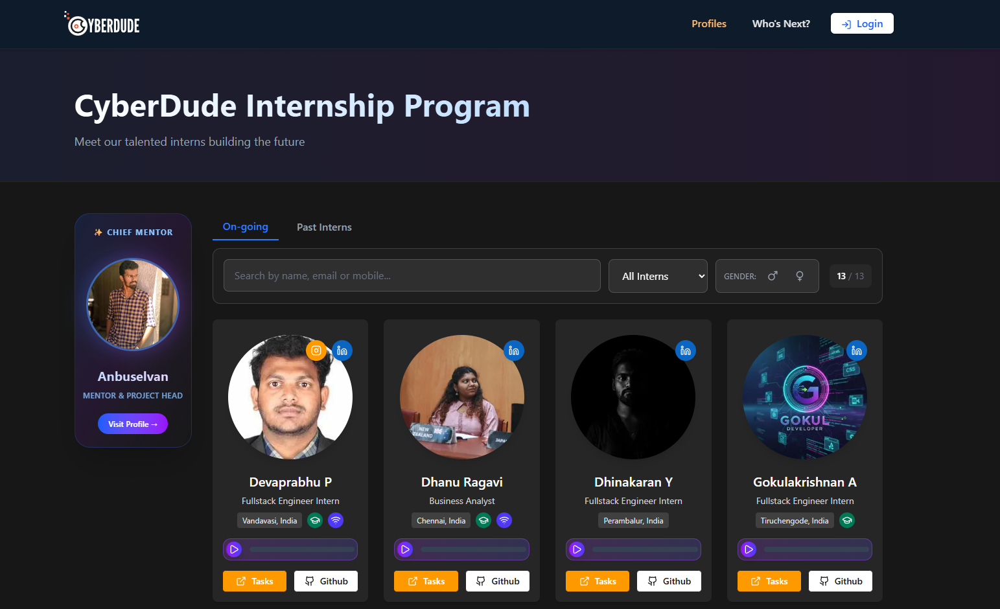
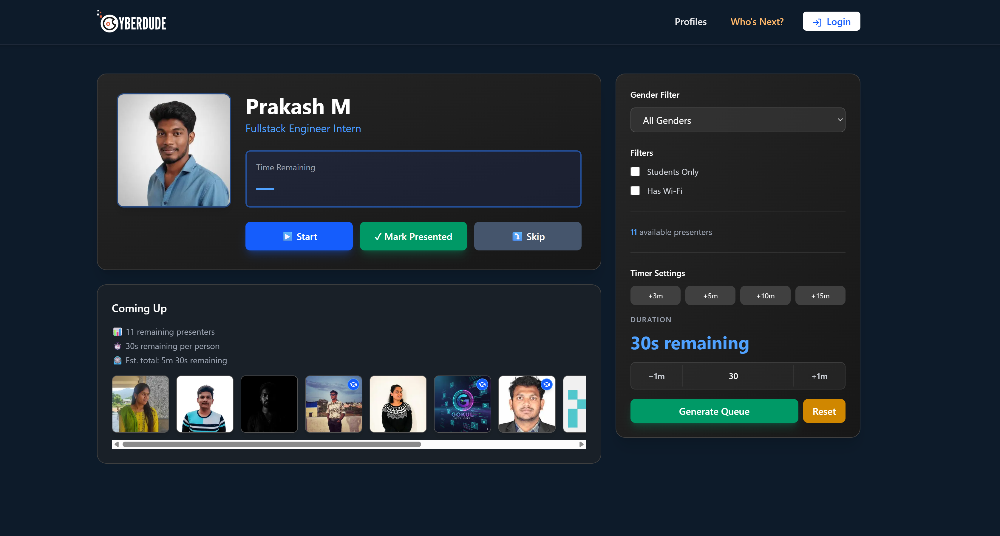
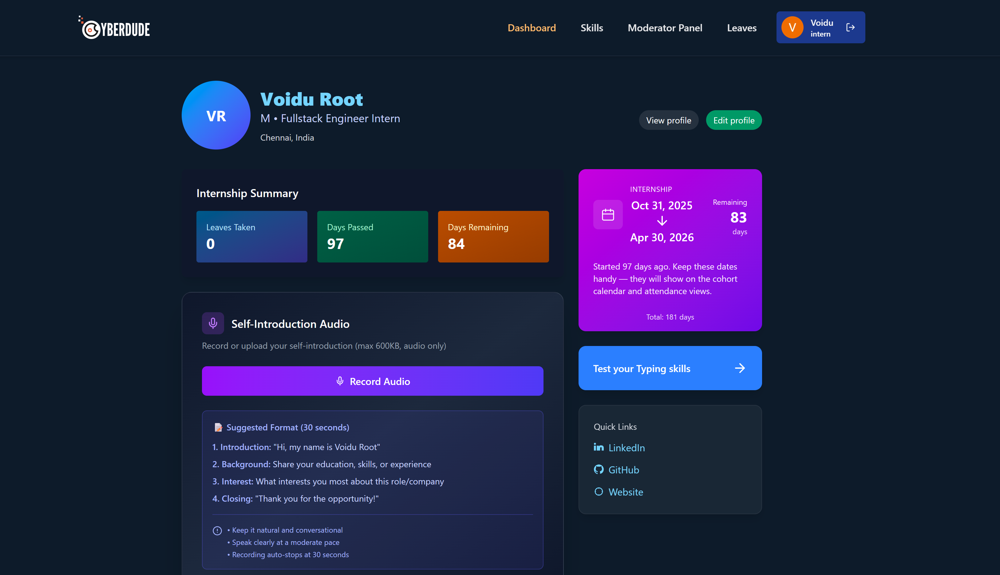
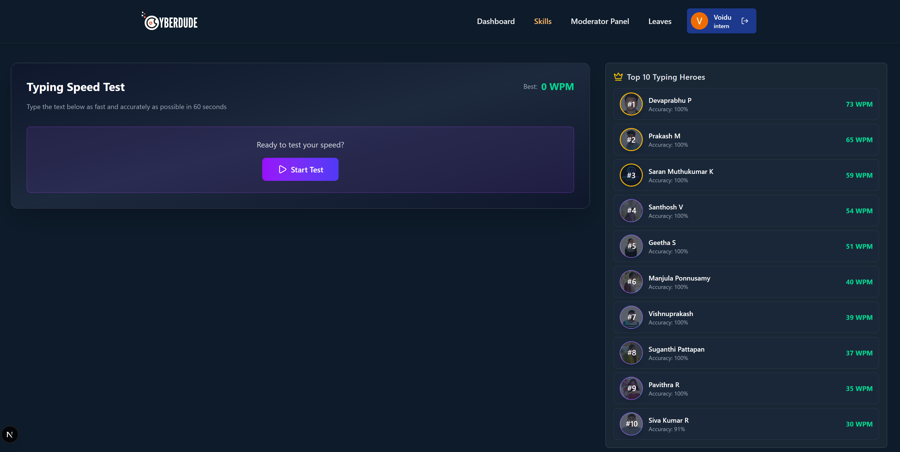
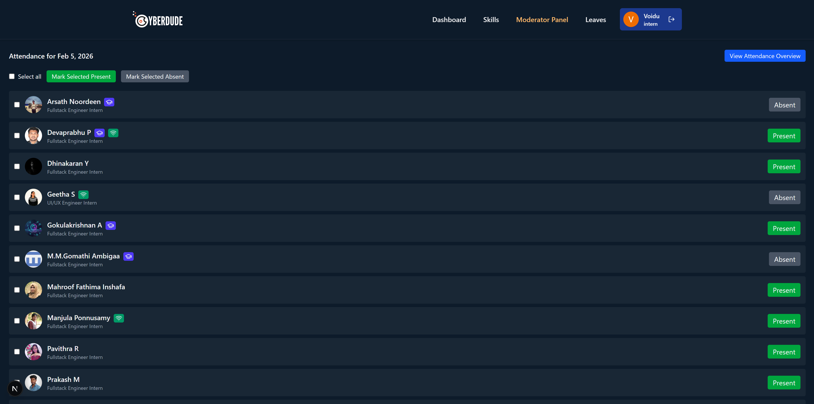
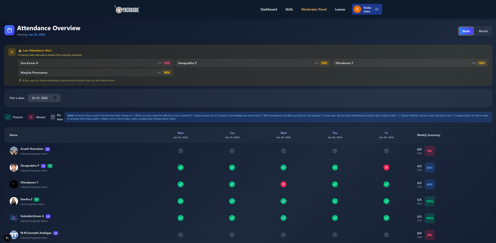
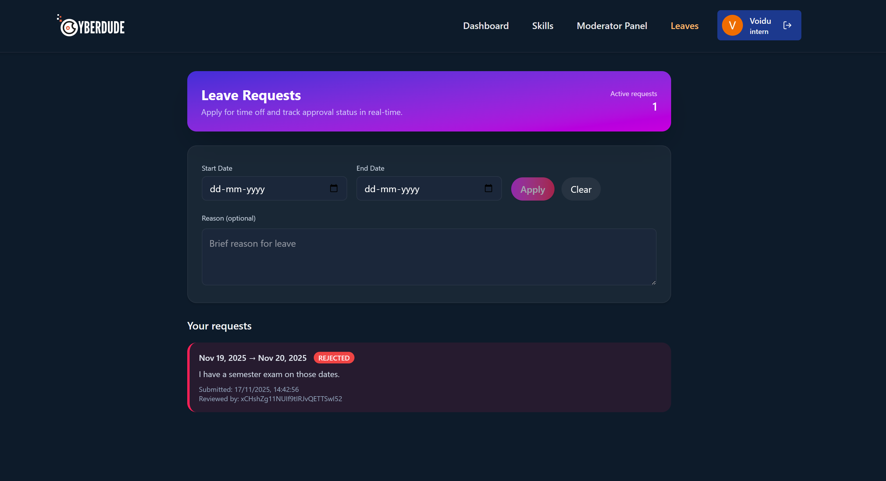

# 🎓 CyberDude Internship Management System

CyberDude's internship management platform designed to streamline intern onboarding, tracking, and engagement for the CyberDude Internship Program. This modern web application provides a complete suite of tools for managing intern profiles, attendance, tasks, skills, and performance metrics.


[](https://github.com/anburocky3/interns)
[](https://github.com/anburocky3/interns)
[](https://github.com/anburocky3/interns)

[](https://discord.gg/6ktMR65YMy)
[](https://www.youtube.com/c/cyberdudenetworks)

## 📸 Screenshots









## ✨ Features

### 👥 Intern Management

- **Comprehensive Profiles**: Display intern information with avatars, contact details, social links, and positions
- **Current & Past Interns**: Toggle between active and alumni interns with certificate information
- **Advanced Filtering**: Search and filter by name, email, mobile, student status, Wi-Fi availability, and gender
- **Audio Introductions**: Upload and play audio self-introductions for each intern
- **Profile Editing**: Interns can update their profiles with personal information and social links

### 📊 Dashboard & Tracking

- **Personalized Dashboard**: Role-based dashboards for interns, moderators, and admins
- **Attendance System**: Real-time check-in/check-out with geolocation tracking
- **Weekly Tasks**: Track and manage weekly assignments with status updates
- **Typing Test Module**: Built-in typing speed test with WPM and accuracy tracking
- **Skills Management**: Organize and display intern skills and competencies

### 🎯 Admin & Moderator Features

- **Moderator Panel**: Dedicated interface for moderators to manage interns
- **Attendance Reports**: View and analyze attendance data
- **Leave Management**: Track and approve intern leave requests
- **Presentation Generator**: Tools for creating and managing intern presentations
- **User Management**: Admin controls for managing user roles and permissions

### 🎨 User Experience

- **Responsive Design**: Fully responsive layout optimized for all devices
- **Dark Theme**: Modern dark UI with Tailwind CSS
- **Real-time Updates**: Firebase real-time listeners for attendance and updates
- **Fast Performance**: Optimized with Next.js SSR and caching strategies
- **Interactive UI**: Smooth transitions and hover effects with Lucide React icons

## 🛠️ Tech Stack

### Frontend

- **Framework**: Next.js 16.0 with App Router
- **UI Library**: React 19.2
- **Language**: TypeScript 5.x
- **Styling**: Tailwind CSS 4.x
- **Icons**: Lucide React
- **Forms**: React Hook Form
- **Notifications**: React Hot Toast

### Backend & Services

- **Database**: Firebase Firestore
- **Authentication**: Firebase Auth (Google Sign-In)
- **Storage**: Vercel Blob Storage
- **Hosting**: Vercel (recommended)

### Development Tools

- **Linting**: ESLint with Next.js config
- **Package Manager**: npm/pnpm

## 🚀 Getting Started

### Prerequisites

- Node.js 20.x or higher
- npm or pnpm
- Firebase account
- Vercel account (for blob storage)

### Installation

1. **Clone the repository**

   ```bash
   git clone https://github.com/anburocky3/interns.git
   cd interns
   ```

2. **Install dependencies**

   ```bash
   bun install
   # or
   npm install
   ```

3. **Set up Firebase**
   - Create a new Firebase project at [Firebase Console](https://console.firebase.google.com/)
   - Enable **Authentication** → **Google Sign-In**
   - Create a **Firestore Database** (production or test mode)
   - Deploy Firestore security rules from `firestore.rules`

4. **Configure environment variables**

   Create a `.env.example` file in the root directory:

   ```env
   NEXT_PUBLIC_FIREBASE_API_KEY=your_api_key
   NEXT_PUBLIC_FIREBASE_AUTH_DOMAIN=your_project.firebaseapp.com
   NEXT_PUBLIC_FIREBASE_PROJECT_ID=your_project_id
   NEXT_PUBLIC_FIREBASE_STORAGE_BUCKET=your_project.appspot.com
   NEXT_PUBLIC_FIREBASE_MESSAGING_SENDER_ID=your_sender_id
   NEXT_PUBLIC_FIREBASE_APP_ID=your_app_id
   ```

5. **Create the first admin user**
   - Sign in to the app with your Google account
   - In Firebase Console, navigate to Firestore Database
   - Find your user document in `/users/{uid}`
   - Set the `role` field to `"admin"`

6. **Run the development server**

   ```bash
   bun run dev
   # or
   npm run dev
   ```

7. **Open your browser**

   Navigate to [http://localhost:3000](http://localhost:3000)

## 📁 Project Structure

```
interns/
├── app/
│   ├── (interns)/          # Intern-specific routes
│   │   ├── dashboard/      # Intern dashboard
│   │   ├── interns/        # Intern profiles
│   │   ├── leaves/         # Leave management
│   │   ├── mods/           # Moderator panel
│   │   └── skills/         # Skills page
│   ├── api/                # API routes
│   ├── presentations/      # Presentations page
│   ├── profile/            # Profile editing
│   ├── layout.tsx          # Root layout
│   ├── page.tsx            # Home page
│   └── globals.css         # Global styles
├── components/
│   ├── ui/                 # Reusable UI components
│   ├── dashboard/          # Dashboard components
│   ├── icons/              # Custom icons
│   ├── AttendanceCheckin.tsx
│   ├── AudioUpload.tsx
│   ├── Header.tsx
│   ├── InternCard.tsx
│   ├── InternGrid.tsx
│   ├── PresentationGenerator.tsx
│   ├── Providers.tsx
│   └── TypingTestModule.tsx
├── context/
│   └── AuthContext.tsx     # Authentication context
├── lib/
│   ├── hooks/              # Custom React hooks
│   ├── firebase.ts         # Firebase configuration
│   ├── getUsers.ts         # User data fetching
│   ├── helpers.ts          # Utility functions
│   ├── internProfile.ts    # Profile operations
│   └── typingStats.ts      # Typing test logic
├── types/
│   └── index.ts            # TypeScript type definitions
├── public/
│   └── images/             # Static images
├── firestore.rules         # Firestore security rules
├── next.config.ts          # Next.js configuration
├── tailwind.config.ts      # Tailwind CSS configuration
├── tsconfig.json           # TypeScript configuration
└── package.json            # Project dependencies
```

## 📖 Usage

### For Interns

1. **Sign In**: Use your Google account to sign in
2. **Complete Profile**: Add your details, social links, and upload an audio introduction
3. **Check Attendance**: Use the attendance check-in feature daily
4. **Track Tasks**: View and update your weekly tasks
5. **Test Typing Speed**: Practice with the built-in typing test module
6. **View Schedule**: Check upcoming sessions and presentations

### For Moderators

1. **Access Moderator Panel**: Navigate to `/mods` after signing in
2. **View Attendance**: Monitor intern attendance records at `/mods/attendance`
3. **Manage Interns**: Review and update intern information
4. **Track Progress**: Monitor task completion and skill development

### For Admins

1. **Full Access**: Admins have complete access to all features
2. **User Management**: Assign roles and manage user permissions
3. **Leave Approval**: Review and approve leave requests
4. **Generate Reports**: Create presentations and reports

## 🔐 Security

- **Firestore Rules**: Security rules are defined in `firestore.rules`
- **Role-Based Access**: Different permissions for interns, moderators, and admins
- **Authentication**: Google OAuth via Firebase Authentication
- **Data Validation**: Input validation on both client and server

## 🤝 Contributing

Contributions are welcome! Please follow these steps:

1. Fork the repository
2. Create a feature branch (`git checkout -b feature/amazing-feature`)
3. Commit your changes (`git commit -m 'Add some amazing feature'`)
4. Push to the branch (`git push origin feature/amazing-feature`)
5. Open a Pull Request

### Code Style

- Follow the existing TypeScript and React conventions
- Use Tailwind CSS for styling
- Write meaningful commit messages
- Add comments for complex logic

## 📝 License

This project is proprietary and confidential. All rights reserved by CyberDude Networks.

## 🙏 Acknowledgments

- **CyberDude Networks** - For providing the platform and opportunity
- **All Contributors** - For their valuable contributions
- **Interns** - For testing and providing feedback

## 📞 Support

For support, email support@cyberdudenetworks.com or visit our website at [cyberdudenetworks.com](https://cyberdudenetworks.com)

---

**Built with ❤️ by the CyberDude Team**
